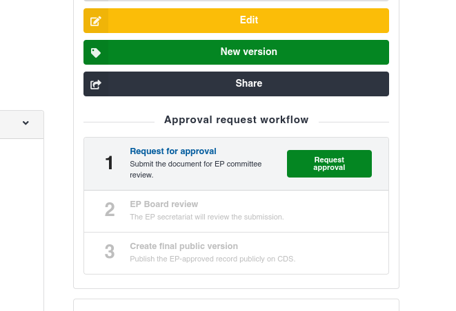
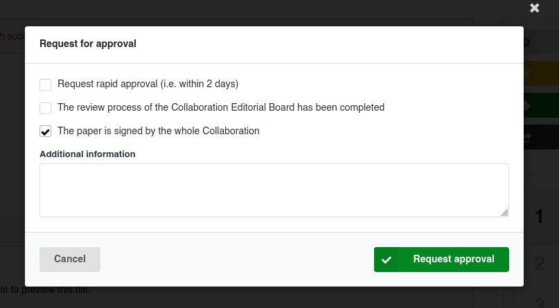
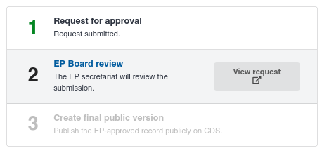
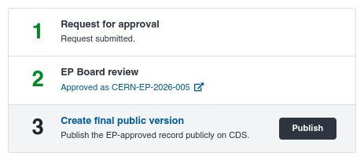

# Committee approval process

Some records on CDS require the approval of specific committees before they can be published.
This mainly applies to research publications from CERN experimental collaborations, which usually need to be reviewed by a committee from the Experimental Physics (EP) department.

This approval process happens within CDS and can be managed in a few easy clicks.

At the moment, the following committee approval processes are available in CDS:

<!-- We can remove this table, just thought it would be useful for if/when we add support for other approval processes -->

| Process name                                                                           | Applies to                                                                   | Estimated waiting time             |
| -------------------------------------------------------------------------------------- | ---------------------------------------------------------------------------- | ---------------------------------- |
| [Experimental Physics (EP) Approval](https://ep-dep.web.cern.ch/ep-publishing-policy/) | Most research publications created in experimental collaboration communities | 1 week (2 days for rapid approval) |

## Typical workflow

### 1. Upload a record

To start, [create and submit a record](../deposit/upload.md) to your experimental collaboration's community.
Ensure that the record is set to **fully restricted**.
This ensures its contents are not publicly visible until the approval process is complete.

Depending on the community's settings, [a review might be required](../review/review.md) by your collaboration's curators.
This review decides whether the record should be included in the community — it is distinct from the committee approval process and happens before it.

### 2. Request committee approval

On the record's page, an approval request workflow tracker will be shown.

Click the **Request approval** button and answer the questions.
The "Additional information" field is optional and can be used to provide more details for the approval process.

Once you are ready, click the **Request approval** button.
The request will be submitted to the relevant committee.

!!! info "Required permissions"

    The approval request workflow tracker is visible to all members of your collaboration's community.

    The button to submit an approval request is only available to [**Managers and Owners**](../communities/communities.md#members-and-roles) of the community.

    If you cannot see the button, please check to ensure you have the necessary permissions.
    If it is still not visible, please [contact the CDS team for support](https://cern.service-now.com/service-portal?id=service_element&name=CDS-Service).

### 3. Wait for committee approval

In the workflow tracker, click the **View request** button to view the approval request.
The submitted details as well as the latest comments will be shown.
[Various advanced commenting features](../review/comments.md) are available to help make discussing the approval request easier.

During the review, your record will still be restricted, and will only be visible to members of your collaboration's community, as well as the approval committee.

The review can be viewed by the community's [Curators (and above)](../communities/communities.md#members-and-roles), the approval committee, and any [manually invited reviewers](../review/review.md#who-takes-part).

### 4. Create the final public record

After the committee approval has been granted, the record still remains restricted and is not publicly visible.
A **Report Number** is automatically generated, which uniquely identifies the approved record.

A final, public version of the record still needs to be created manually.
This can done by [Curators, Managers, and Owners](../communities/communities.md#members-and-roles) of the collaboration's community.

To do this, simply click the **Publish** button in the workflow tracker on the record's page:

Follow the instructions in the modal that appears, and click **Publish**.
The public record will be created; click **View public record** in the workflow tracker to view it.

The new public record will be included in both your collaboration's community and the [CERN Research](https://repository.cern/communities/cern-research/records?q=&l=list&p=1&s=10&sort=newest) community.
The Report Number will be visible on it, as well as a link back to the original restricted record (for users who are allowed to access it).

## New record versions

When you submit a record for committee approval, only the submitted version will be visible to the committee, and only this version will be taken into account for the review.
**To avoid confusion, it is not recommended to create a new record version while the approval is pending.**

Once the approval is completed, new record versions can still be created.
When you create the final public record, the latest record version will be published (not necessarily the one that was approved).

## Waiting too long for approval

If your approval request has been pending for a longer time than expected (see the estimated wait times at the top of this page) and your record needs to be published urgently,
please [contact the CDS team for support](https://cern.service-now.com/service-portal?id=service_element&name=CDS-Service).
