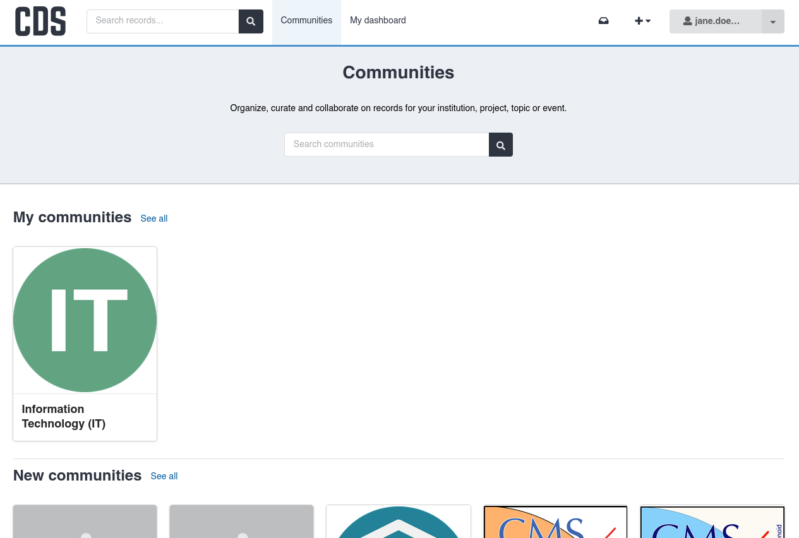

# Communities

On CDS, communities are spaces in which records are curated by specific groups of people, depending on the community's scope.
Communities can allow:

- **Curating** records; specific community members can review submitted records before publication.
- **Managing permissions** by specifying which users or CERN Groups can submit new records.
- **Creating custom pages** such as an About page or a Curation Policy

All records on CDS belong to at least one community.
When a record is created, it must be submitted to a community, but after publication it can also be submitted
to additional ones.

## Create a community

In order to ensure communities have a coordinated, user-friendly structure, the CDS team creates communities on request, following careful evaluation.
Please [contact the CDS team via ServiceNow](https://cern.service-now.com/service-portal?id=sc_cat_item&name=request&se=CDS-Service), specifying the following details:

- The intended name
- A square logo (maximum 1MB)
- A short description of what the community will be used for
- The type of records that will be published in the community (please send links to examples if possible)
- Whether reviews should be mandatory for newly submitted records (see [Submission policy](./manage.md#submission-policy))
- Whether the community's contents should be publicly visible
- The name of a dedicated [GMS group](https://auth.docs.cern.ch/groups/overview/) to set as the initial member of the community

## Members and roles

Communities have members, each with a role which describes their level of access.
A member can be a CERN user or a group.
Community owners can specify the initial members, which can then later be edited.

Each member can have one of the following roles:

- **Reader**: Can view all records inside the community, including restricted ones.
- **Curator**: Can curate/review records submitted to the community and can view all records.
- **Manager**: Can manage members and roles, can curate records, and can view all records.
- **Owner**: Full administrative control over all aspects of the community.

!!! info "Access for non-members of the community"

    CDS users who are not members of a community can still view its public records and its details.
    This can be changed in the community's settings.

    Non-members cannot view the community's restricted records, unless they have been granted [explicit permission](../deposit/access-share.md) on a per-record basis.

[Find out more](./manage.md#members) about managing community members.

## View your communities

To view the communities you are a member of, or to see a full list of communities on CDS, click on the "Communities" tab at the top of the page.

The communities you are a member of are listed under "My communities", while the latest communities created on CDS are under "New communities".
To show more results in either section and to search for communities, click "See all".
