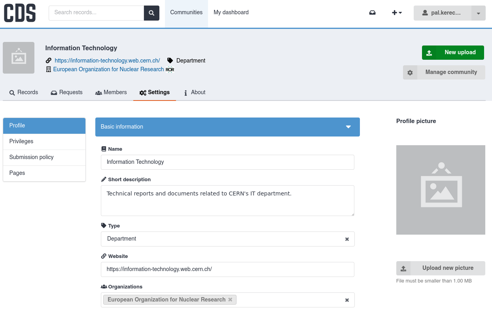
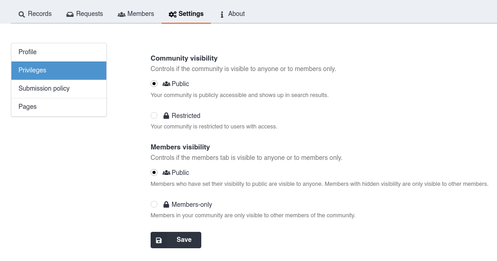
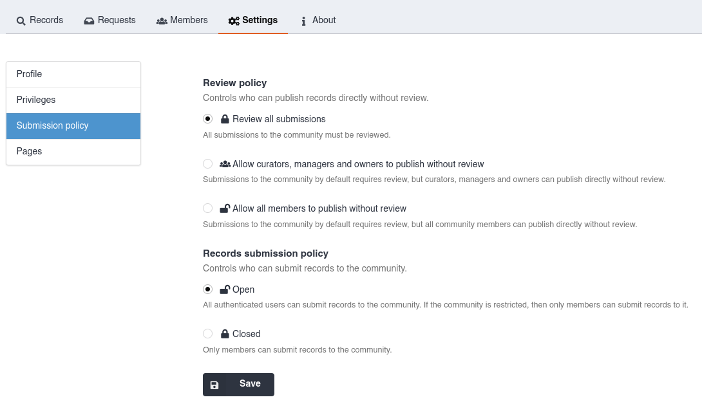
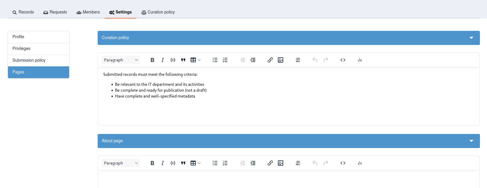
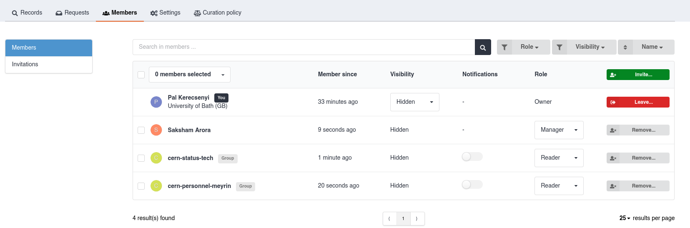
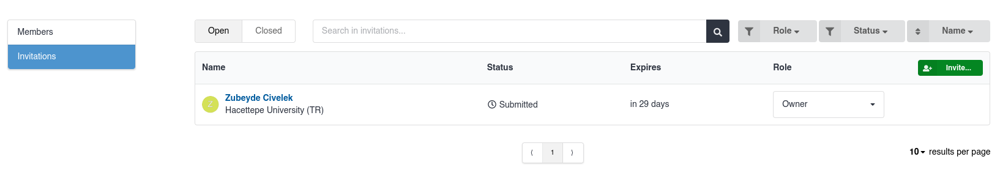
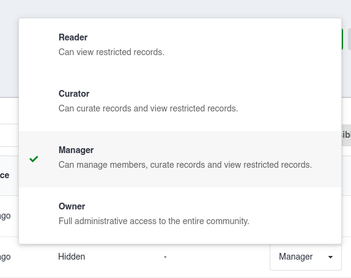
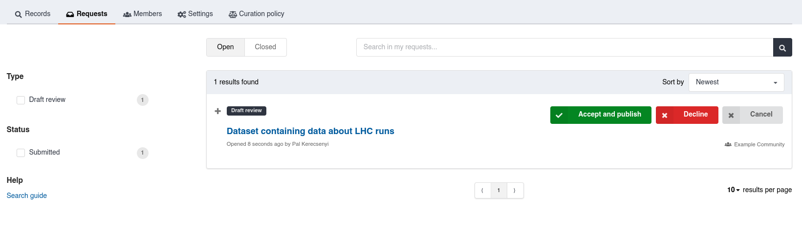

# Manage a community

Communities can be managed by their members. What each member can do depends on their role.
See [About communities](./communities.md#members-and-roles) for the list of roles and what they mean.

## Settings

Properties of a community can be changed by members who have the **Manager** or **Owner** role. Open the community and use the **Settings** tab.

### Profile

On the "Settings" tab you can change public-facing information about the community.
We recommend filling in as much of this as possible so visitors understand the purpose and background of the community.

The profile picture acts as a logo, shown across CDS wherever the community is referenced.

Please ensure the picture meets the following criteria:

- Stays clear even when very small
- Square shaped
- Maximum 1MB

### Visibility

On the "Privileges" section of the "Settings" tab, you can control whether the community itself is public or restricted.

- **Public** communities are visible to everyone and show up in the list of communities on the CDS website. All parts of the community's profile can be seen by everyone, as well as the public records that belong to it. Restricted records can be seen by the members of the community or users with explicit access.

- **Restricted** communities are only accessible by members. The community does not show up search results and its profile cannot be viewed by non-members. All records of the community must be restricted too.

You can also configure whether the list of members is visible to everyone or only to members.

### Submission policy

The submission policy defines who is allowed to submit records to the community and whether they will need to undergo a review before publication.

The review policy sets which submissions require a review.
By default, all submissions require a review.
You can change this so that members with certain roles (as shown) can submit directly without a review.
When these users submit a record, the record will get associated with the community instantly.

You can also disable reviews entirely by selecting "Allow all members to publish without review".
Records submitted by non-members of the community (if allowed) still require a review.

By default, any CDS user can submit records to a public community.
You can change the records submission policy to "Closed" so that only members can submit records.

### Pages

On the "Pages" section of the "Settings" tab, you can customise the "Curation policy" and "About" pages, which are shown to all users viewing the community.

- The **Curation policy** can be used to specify criteria and guidelines for records submitted to the community. Specify as much detail as possible to make reviewing submissions easier.
- The **About** page can be used to provide more information about the community and its purpose.

## Members

You can view a list of the community's members and their roles in the "Members" tab.

Members can be either **people** (referring to CERN users) or **groups** (referring to [GMS groups](https://auth.docs.cern.ch/groups/overview/), formerly known as e-groups).
If a role is applied to a group, it will be applied to all members of the group.

!!! info "Permissions for managing members"

    Only members with the **Owner** and **Manager** roles can manage members. See more details about roles in [About communities](./communities.md#members-and-roles).

To **add a new member**:

1. Click on "Invite".
2. Select either the "People" or "Groups" tab
3. Search for the user or group you want to add.
4. Select the role to assign to the member
5. Click on "Invite".

Users will receive an email invitation to join the community; their membership will only be confirmed once they have accepted the invitation.
Groups will be added immediately.

You can view pending invitations in the "Invitations" tab.
Invitations that have not yet been accepted or rejected will be shown in the "Open" tab.
You can change the member's role before they accept the invitation.

- To **cancel an invitation**, click on the invited member's name, and click on the "Cancel" button.

- To **remove a member**, click the "Remove" button next to their name.

- To **change a member's role**, select a new role from the dropdown menu.

  

!!! info "Membership visibility"

    You can change whether others can see your membership by selecting an option from the dropdown menu next to your name.

## Managing submission requests

When someone submits a new record to your community, it may appear as a **submission request** for your community to review, depending on the community's [review policy](#submission-policy).
These requests are shown in the community's "Requests" tab.

Curators review submitted records and suggest changes to ensure their content and metadata meet the community's requirements.

Community members with a role of **Curator** or above (see [more details about member roles](./communities.md#members-and-roles)) can view these requests from the community interface, **review** the submitted record, leave **comments**, and **accept** or **decline** it. Until a request is accepted, the record is in the "In review" stage and is not publicly visible as part of the community.
The record may still be accessible if it has already been published to another community.

See [About reviews](../review/review.md) for more details.
