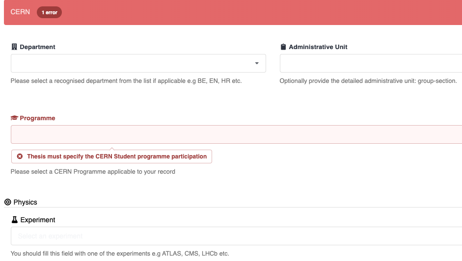
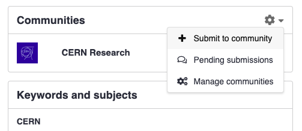
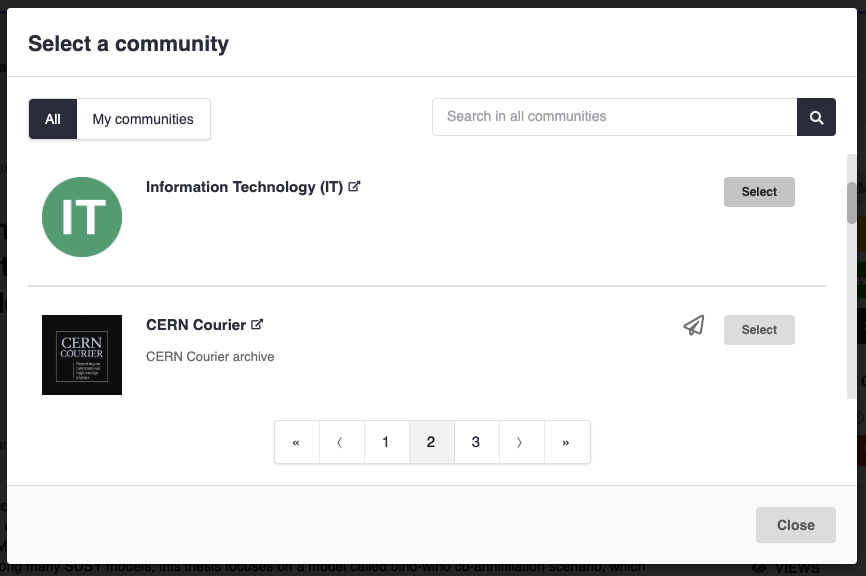
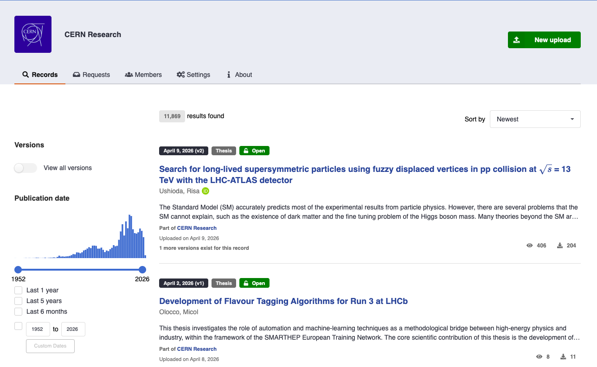

# Submit to a community

When you are uploading a record, it needs to be reviewed by a community. Communities may have their own metadata requirements and review workflows. This page explains what happens during submission, how to handle metadata issues, and how to manage community membership for your records.

## Where should I submit?

If you are unsure which community to submit to, the table below covers the most common cases:

| Your record | Recommended community |
|---|---|
| Publication, preprint, thesis, or conference paper authored at or in collaboration with CERN | [CERN Research](https://repository.cern/communities/cern-research) |
| Internal CERN report, note, or technical document | The relevant experiment or department community, if one exists |
| Dataset or software produced as part of a CERN experiment | The relevant experiment community |

!!! note "Can't find your community?"

    If your community does not appear in the new CDS or the deposit form, it may still only be present in the legacy CDS. Communities are being migrated progressively to the new CDS.
    See the [CDS Migration page](https://new-cds-project.docs.cern.ch/) for updates on the migration status and timeline.

!!! tip "Submitting software to CDS"
    
    If your software is in a repository on either CERN's internal GitLab instance ([gitlab.cern.ch](https://gitlab.cern.ch)) or on [GitHub.com](https://github.com), you can set up automatic archiving in a few easy steps.

    See our [guide to GitLab & GitHub repositories](../deposit/repositories.md).

You can submit your record to more than one community only **after** your record has already been published to an initial community.
Only then can you submit it to additional communities if it fits multiple scopes. See [Multiple communities](#multiple-communities) below for details.

!!! tip

    Start your upload from within a community by clicking **New upload** button on the community page. This pre-selects the community in the deposit form.

## Metadata checks

Before a record can be accepted into a community, CDS checks that the record's metadata meets the community's requirements. These checks run automatically when you submit.

If any required fields are missing or invalid, you will see the list of issues that must be resolved before the submission can proceed as shown.

## Multiple communities

You can submit the same record to more than one community. Each submission is independent: a record can be accepted by one community while still under review in another.

To submit to an additional community after the record is already published:

1. Open the record's page.
2. Navigate to the Communities Panel (on computers, it's on the right; on phones/tablets, scroll down to the bottom of the page).

3. In the dropdown menu, select **Submit to community**.
4. Search for and select the community you want to submit to.
5. Add an optional message for the community curators and confirm the submission.

!!! note

    Each community has its own review process. Submitting to multiple communities means each community's curators will independently review and decide on your record.

## Removing from a community

!!! note "Removing from a community is not possible"
    If you need to change/remove the community associated with your record, please contact the [CDS support team](https://cern.service-now.com/service-portal?id=service_element&name=CDS-Service).

If a submission is still under review (not yet accepted), you can withdraw it instead of removing it:

1. Go to [your requests dashboard](https://repository.cern/me/requests), or click the inbox icon at the top right of any page.
2. Find the submission you wish to withdraw in the list of requests.
3. Click the **Cancel** button next to the relevant submission.

!!! tip

    If you open the individual request page, you'll also find a **Cancel** button in the top right corner for quick access.

---

## CERN Research

[**CERN Research**](https://repository.cern/communities/cern-research) is the one of the primary communities for storing scientific output produced at or in collaboration with CERN. It is intended for peer-reviewed publications, preprints, conference papers, theses, and other research outputs.

### Who should submit

You should submit to CERN Research if your record is:

- A thesis carried out at CERN or under CERN supervision.
<!-- TODO: Add more when finalized -->

### Review workflow

Submissions to the CERN Research community go through a curator review before being listed in the community. The typical workflow is:

1. The CERN Research community curators receive a notification when you submit to review your submission.
2. If the metadata is complete and the record meets the community's scope, the curators accept the submission. The record then appears in the CERN Research community.
3. If changes are needed, the curators will leave a comment on the submission request. You will receive a notification and can update the record and ask for a re-review by dropping a comment.

!!! note

    Acceptance into CERN Research does not replace journal publication or any other formal publishing process. It makes the record discoverable within the CERN Research community on CDS.

## Submission policies

Before submitting to CDS, make sure your record complies with the relevant CERN policies:

- [**Operational Circular No. 6 (OC6)**](https://repository.cern/records/pnzz5-0b788) governs the dissemination of CERN publications. It defines which outputs must be deposited, embargo rules, and open-access obligations. All records submitted to CERN Research are expected to comply with OC6.
- The [**CERN Authors Guide**](https://cern-sis.github.io/cern-authors-guide/) provides practical guidance on authorship, affiliation formatting, acknowledgements, and how to handle journal submissions correctly. Following the guide helps ensure your record's metadata is accepted without changes during the review.
