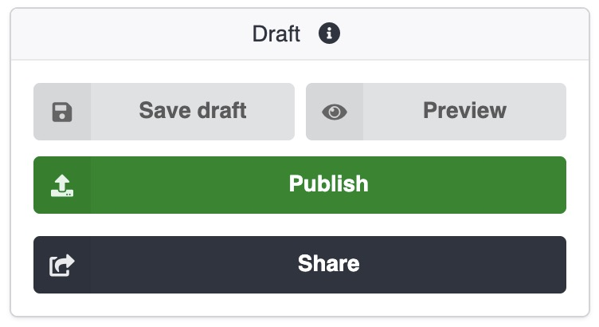
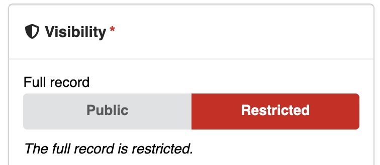
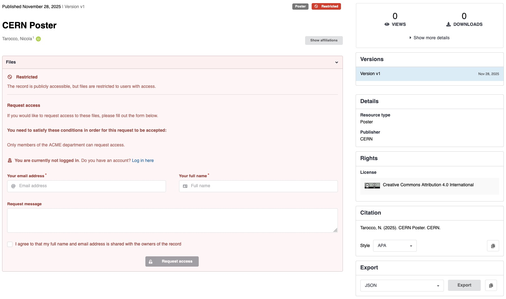
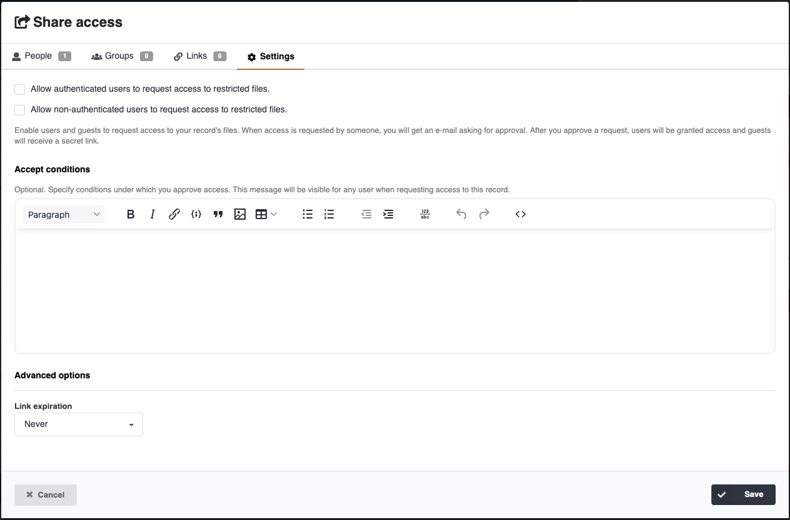

# Access & Share

Until published, your upload is accessible only by you, and it is not visible or findable in CDS.

To grant access for viewing or editing your upload, you can click on the **Share** button:

{ width="300" }

The share interface allows you to define which users and e-groups can access, with granular rights.
You can also generate shareable links that can be send to colleagues who cannot login in CDS.

In the **Visibility** section, you can change the access settings to your upload when published.
You can restrict access to your entire record, metadata and files, or only to files:

{ width="300" }

### Enable access requests

For published records with restricted file access (but public metadata), you can enable **access requests**.
In the record page, unauthorized users will see a **Request access** form instead of a permission error:

You can enable or disable the access request feature from the **Share** interface, in both upload or record page.

You can define if only logged in users or also anonymous users can request access,
and provide an help text that will be displayed to unauthorized users.

When an unauthorized user will request access, you will receive an e-mail notification to approve or deny the request.

## Who can access

### Drafts

The uploader can always access their drafts.
Users, e-groups and receivers of links defined in the share interface will be able to access and perform the related actions.

### Records

Any sharing permission defined when uploading is persisted on publish.

When a record is part of one or multiple communities, **all community members** will also be able to **access** the record.
Community curators, managers and owners will also be able to **edit** the record.

## Record versions

Record's visibility and share permissions are applied **only to a specific version** of a record.
When creating a new version, visibility and share permissions have to be re-defined.

**Community members** can always access to **all versions** of the record.

## Restricted communities

When a record is included to a restricted community, its visibility can only be restricted.

Restricted communities cannot contain public records.
