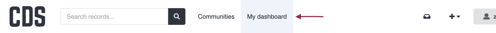
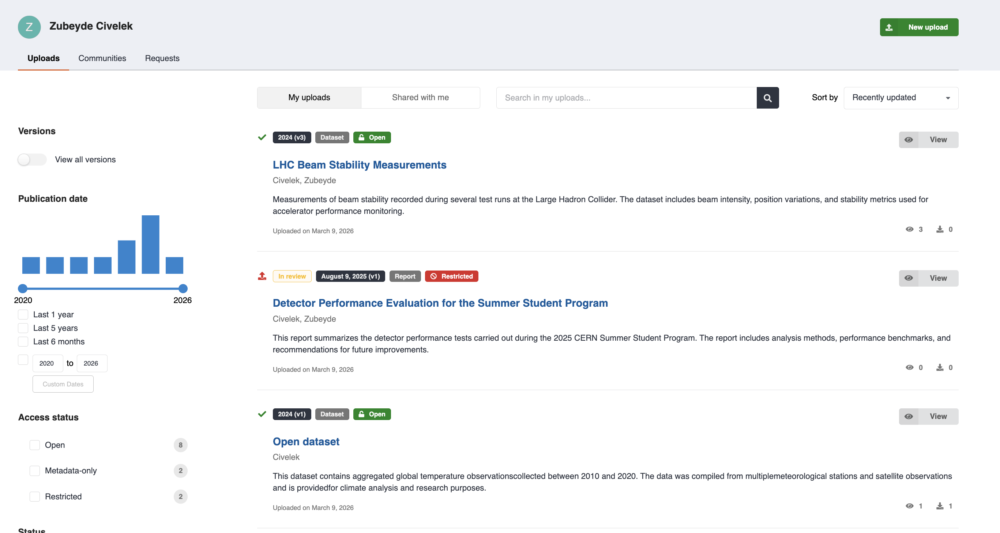
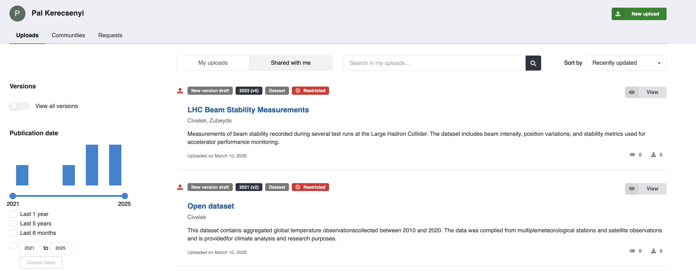
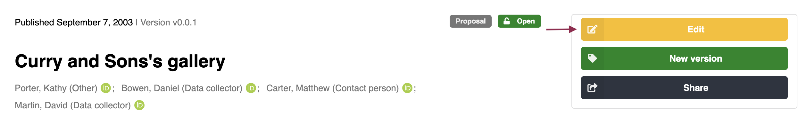
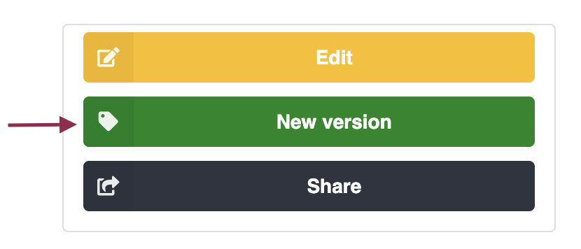
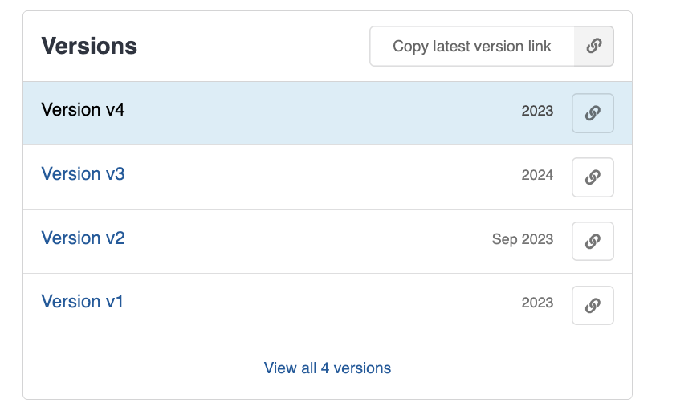

# Published records

Published records are finalized records made available in the repository. Once a record is published, it becomes accessible to other users.

!!! note

    A [**published record**](../glossary.md#published-record) is not necessarily a **[public](../glossary.md#public) record**. Publishing a record means the record is no longer a [draft](../glossary.md#draft) (a temporary working version) but a finalized record registered in the system. Whether the record is publicly accessible depends on its restriction settings.

A published record contains finalized [metadata](../glossary.md#metadata) and associated files. It also displays additional information such as:

- usage statistics
- versions
- [communities](../glossary.md#community)
- citation details

## Your records

To see all your records, go to [My Dashboard](https://repository.cern/me/uploads).

The **My Dashboard** page shows all records you have created or contributed to, including published records and drafts.

From this page you can:

- view your published records
- access and continue editing [draft](../glossary.md#draft) records
- monitor the status of your uploads
- search and filter your records
- create new uploads

Each record entry displays key information such as the title, status ('[open](../glossary.md#public)' or '[restricted](../glossary.md#restricted)'), and the last update date.

Published records are indicated by a green checkmark, while [draft](../glossary.md#draft) records are shown with a red upload icon.

## Records shared with you

Records can be shared with you by other users, allowing you to view or collaborate on them.

To access these records, go to [My Dashboard](https://repository.cern/me/requests) > [Uploads](https://repository.cern/me/uploads) and select the [Shared with me](https://repository.cern/me/uploads?q=&f=shared_with_me%3Atrue) tab.

Shared records may allow different levels of access depending on the permissions granted to you by the record owner.

## Edit

[Draft](../glossary.md#draft) records can be edited at any time before they are published.

To edit a draft:

1. Open the draft from [My Dashboard](https://repository.cern/me/requests) > [Uploads](https://repository.cern/me/uploads).
2. Update the metadata or files as needed.
3. Save your changes.

For published records, only the [metadata](../glossary.md#metadata) can be edited.

To edit metadata of a [published record](../glossary.md#published-record):

1. Open the published record you want to modify.
2. Click **Edit**.
3. Update the metadata.
4. Save and publish the changes.

If you need to modify or replace files, you must create a [new version](../glossary.md#new-version) of the record.

## New version

To modify the files of a [published record](../glossary.md#published-record), create a new version.

To create a new version:

1. Open the published record.
2. Click **New version**.
3. A [draft](../glossary.md#draft) copy of the record is created.
4. Update the [metadata](../glossary.md#metadata) or files as needed.
5. Publish the draft to release the new version.

CDS keeps a version history, so all previous versions remain accessible.

All versions of a record are linked together, allowing you to navigate between older and newer versions.

!!! tip

    To learn more about how [DOIs](../glossary.md#doi) work with record versions, see the [DOI versioning FAQ](https://repository.cern/help/versioning).

## Delete

You cannot delete a [published record](../glossary.md#published-record). Deletion is allowed according to the [Content Policy](https://repository.cern/content-policy).

Please [open a ticket](https://cern.service-now.com/service-portal?id=service_element&name=CDS-Service) if you wish to delete a [published record](../glossary.md#published-record).
