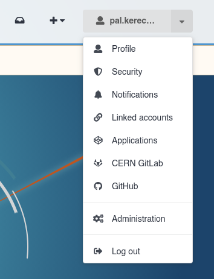
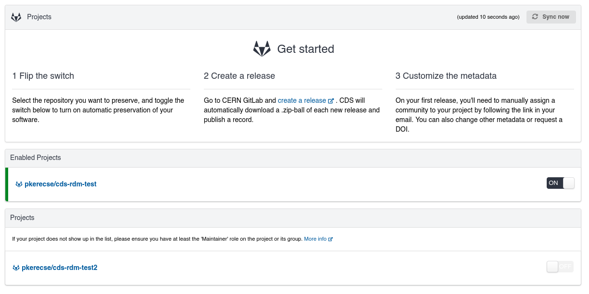
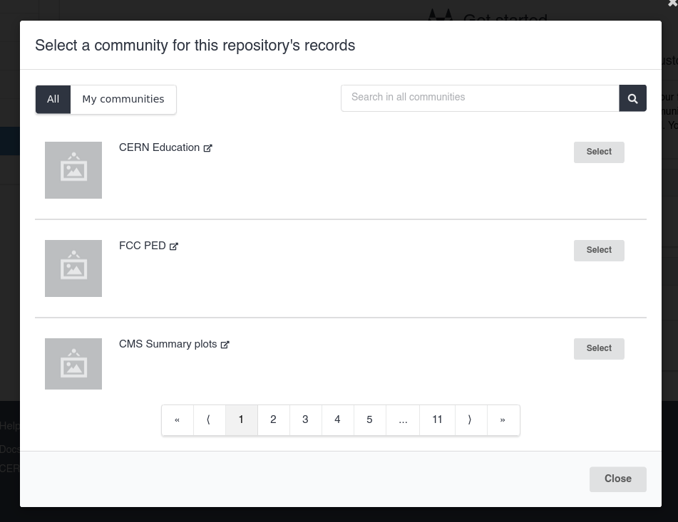
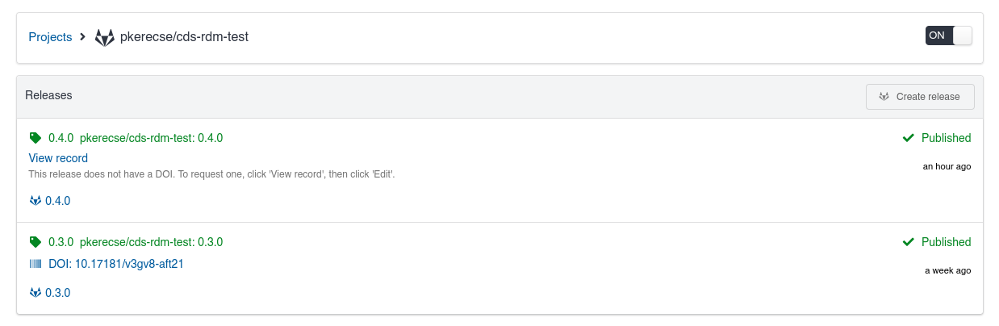

# Publish GitLab and GitHub repositories

You can sync your GitLab and GitHub repositories directly to CDS.
Each new release will create a record on CDS with a ZIP archive of the repository's contents and automatically extracted metadata.

## Connect your account

To be able to sync your repositories, you need to connect your GitLab and/or GitHub account.

1. From any page on CDS, click on the user dropdown, and click either **CERN GitLab** or **GitHub**. The option you select depends on where your repository is located.
    - Select **CERN GitLab** if your repository is on [**gitlab.cern.ch**](https://gitlab.cern.ch).
    - Select **GitHub** if your repository is on [**github.com**](https://github.com).

    {width=200px}

2. Click **Connect** and follow the steps to log in with the service.
3. Your repositories will show up in a list.

    

!!! info "Supported repository services"

    **We only support CERN's internal GitLab instance and public GitHub.** We do not currently support
    any other repository services. If your repository is hosted elsewhere, you can create and publish records
    for its releases manually: see how to [upload a record](./upload.md).

!!! info "Repository visibility"

    **Only repositories for which you have sufficient access permissions are shown.**
    In general, you must be able to view the repository and manage its webhooks. 
    If you do not have the correct level of access to a repository, it will not be visible in the list on CDS.

    On GitLab, this means you need either the **Maintainer** or **Owner** role on the project or its group. See [GitLab's project permissions documentation](https://docs.gitlab.com/user/permissions/#projects) for more information.

    On GitHub, this usually means you need at least the **Admin** role on the repository. See [GitHub's roles documentation](https://docs.github.com/en/organizations/managing-user-access-to-your-organizations-repositories/managing-repository-roles/repository-roles-for-an-organization) for more information.

## Enable a repository

When a repository is enabled, CDS will start listening for releases and automatically create a record when a new one is received.
By default, none of your repositories are enabled, so no records will be created.

1. Find the repository in the list. If you cannot find it, please refer to the "Repository visibility" section above.
2. Click on the **toggle switch**.
3. Select the [community](../communities/communities.md) that records made for the repository's releases should be published to.
    All records on CDS must be published to a community. The record will be subject to the [community's review policy](../communities/submit.md) as normal.

    

4. The repository is enabled! New releases from this point will result in the creation of a record on CDS.

## View a repository's releases

Whenever you create a new release for an enabled repository, CDS will receive it and attempt to publish a record from it.

To view the status of a release and the record created from it, click on the repository's name in the list.

### Release statuses
The status of each release is shown. The possible statuses are as follows:

- **Received**/**Processing**: CDS has received the release from GitHub/GitLab and is processing it. This normally takes a few seconds, but can sometimes take longer for very large repositories. If a repository is stuck in this state for a longer time, please [contact the CDS team via ServiceNow](https://cern.service-now.com/service-portal?id=sc_cat_item&name=incident&se=CDS-Service) with the full name of your repository.

- **Failed**: There was a problem creating a record from the release. Usually, this means some part of the repository contained unexpected data. Click on the release and click on the "Errors" tab to see more information. 

- In most cases, you will need to modify the repository, and then create a new release.
- If an "Edit record" button is visible, you can instead edit the draft record to correct the errors, and then publish it manually.

- **Pending review**: The record was successfully created as a draft and is pending review by the community it was submitted to. Once it is accepted, it will be published immediately. No further action is required from you.

- **Published**: The record has been published.

### Create a DOI

By default, records published from repository releases are not assigned a DOI.
If a release's published record does not have a DOI, you can create one:

1. Click on the **View record** button for the relevant release.
2. Click on the **Edit** button.
3. Follow the [steps to either obtain a new DOI or specify an existing one](./upload.md#dois).
4. Click on the **Publish** button to save your changes.

If a release's record has a DOI, this is shown in the list of releases.

## Disable a repository

Disabling a repository will stop new releases from being published as record on CDS.

!!! warning "Existing records created from repository releases"
    **Disabling a repository will not affect existing records created from its releases**.
    Deleting published records is usually not possible on CDS.
    Please [see the deletion policy](../deposit/published-records.md#delete) for more details.

1. Find the repository in the list. It will be shown above other, non-enabled repositories, in a separate section titled "Enabled Projects" or "Enabled Repositories".
2. Click on the toggle switch.
3. The repository is disabled. New releases will no longer result in the creation of a record on CDS.
