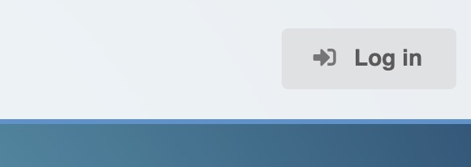
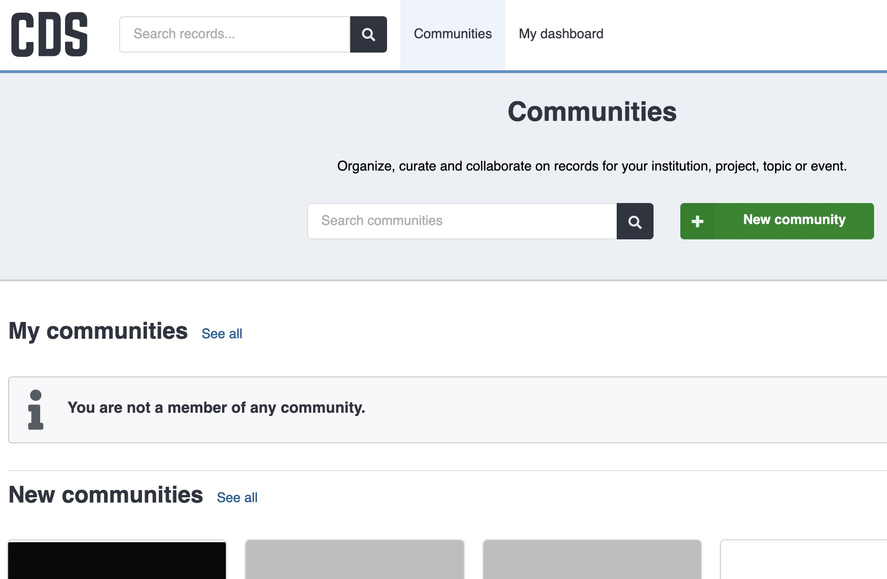
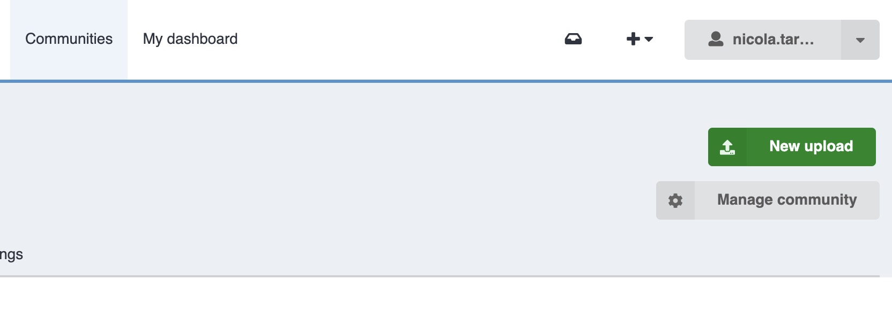
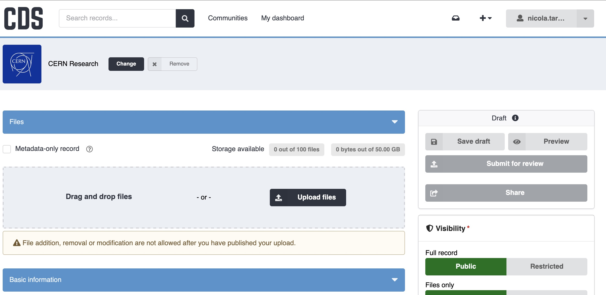
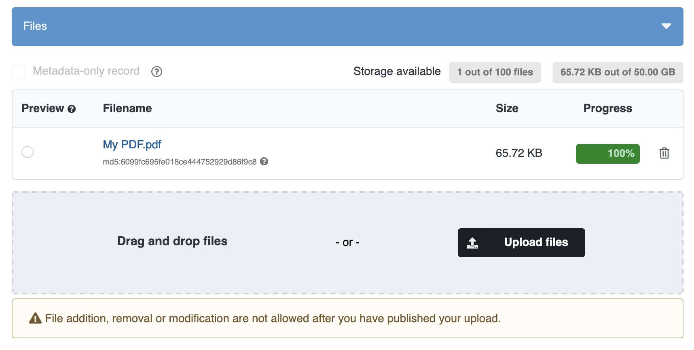
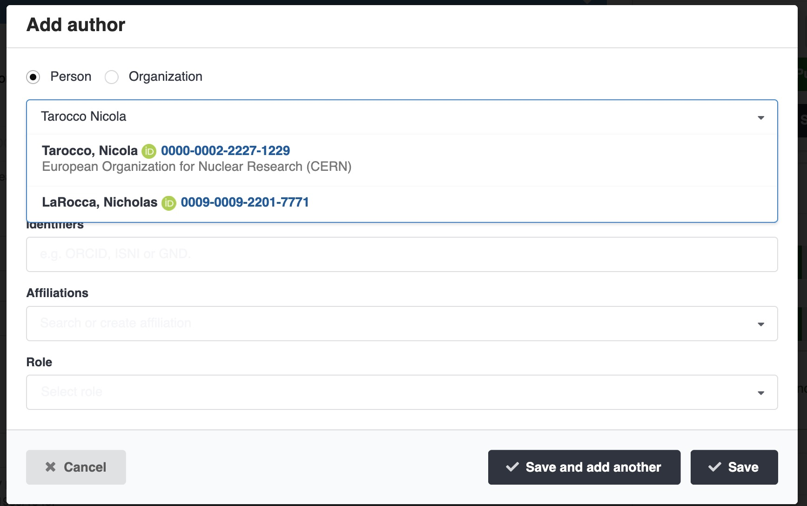
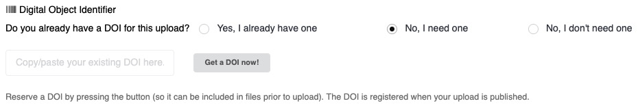
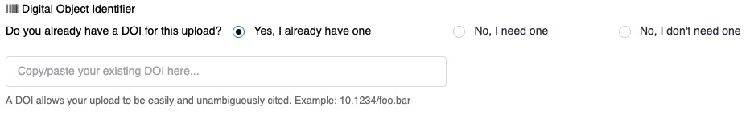
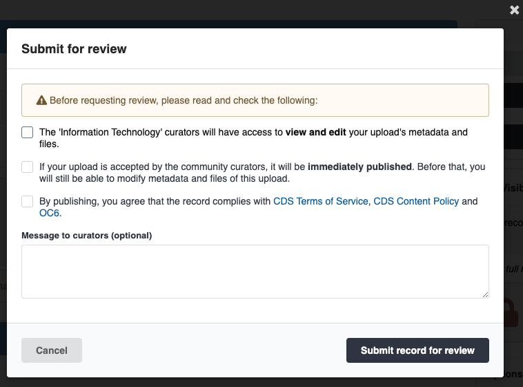

# Upload

To upload new content, first log in with your CERN account by clicking the login button in the top-right corner of any page.

{ width="300" }

!!! Tip

    Only CERN and federated (EduGAIN) accounts can log in to CDS.

The easiest way to start a new upload is to first choose the community where you want to deposit the item. Read more about communities [here](../communities/communities.md).

You can view the communities you manage or search for other communities from the **Communities** menu in the top header:

Then click the green **New upload** button:

{ width="600" }

You will then see the deposit form:

## Files

Click the **Upload files** button, or drag-and-drop one or more files onto the drop zone to start uploading.
By default you can upload up to 100 files with a combined maximum size of 50 GB.
If you need more, please contact us.

!!! Warning

    Make sure you have uploaded all your files before publishing. After publishing you cannot change the files.

### Embargo

You can apply an embargo to one or more files by selecting **Apply an embargo** and configuring the embargo policy:

{ width="300" }

## Required metadata

The following fields are mandatory for each upload:

- **Title**: The title of your upload.
- **Resource type**: Choose one of the available resource types. If you are unsure which type to select, please [contact us](../index.md#need-help).
- **Author/Creators**: Add all authors or creators. Use the autocomplete field to search names; CDS synchronises with the [ORCID](https://orcid.org) and CERN user databases.

{ width="600" }

## DOIs

If you need a DOI, select `No, I need one` and CDS will register a DOI automatically when the record is published. You can also reserve a DOI immediately using the **Get a DOI now!** button.

If you already have an external DOI, provide it in the DOI field:

Avoid registering multiple DOIs for the same upload; if an external DOI already exists, use that one.

Because metadata is submitted to DataCite when registering a DOI, you cannot request a DOI for uploads that are fully restricted.

!!! tip

    When requesting a DOI, CDS will register two DOIs. Read more in the [DOI versioning FAQ](https://repository.cern/help/versioning).

## Other metadata fields

The deposit form supports many additional metadata fields to help describe your upload. Common fields include:

- **Licenses and Copyright**: Specify license and copyright information for your upload.
- **CERN fields**: Add CERN-specific metadata such as experiment, accelerator, department, or project identifiers when applicable.
- **Publishing**: Publication details and related options.

## Access

See the [Access & Share](access-share.md) page for details on changing access restrictions and sharing settings.

## Preview, Save and Publish

You can preview or save your upload at any time using the **Preview** and **Save** buttons:

{ width="300" }

When you are ready, publish your upload by clicking the **Publish** button. You will be asked to agree to the CDS terms and conditions, content policy, and Operational Circular 6.

{ width="500" }

!!! Tip

    After publishing, you cannot change files, but you can update metadata at any time.
