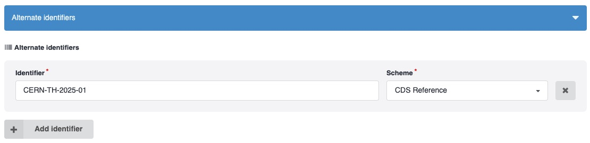

# Frequently Asked Questions

## Report Numbers and DOIs

### What happened to report numbers?

A **report number** (also called RN or reference number) is an identifier that was automatically created by the previous version of CDS. Examples include `CERN-TH-2024-001` or `CERN-EP-2024-309`.

In the legacy system, report numbers were often automatically added to submitted PDFs. However, they had significant limitations:

- **Non-unique references**: no mechanism ensured uniqueness, leading to duplicate references
- **Difficult to search**: users couldn't reliably resolve or find records using report numbers
- **Complex maintenance**: custom generation rules for different collaborations made the system complicated
- **No reservation system**: users would guess the next number for PDFs before submission, but the number could change, causing errors

!!! info "Important Change"

    The new CDS repository **does not automatically generate report numbers**.

Instead, you can:

- Add your own report number(s) in the **Alternate Identifiers** field during submission.
- Use any format your collaboration prefers.
- CDS will ensure uniqueness to prevent duplicates.
- You can re-use the same report number(s) across versions of the record.

### Use DOIs instead

The new CDS repository follows international open science best practices by assigning **DOIs (Digital Object Identifiers)** to all publications.

- **Prefix:** `10.17181`
- **Registration:** All DOIs are registered with [DataCite](https://datacite.org)
- **Assignment:** Automatic upon publication (or can be reserved in advance)

!!! tip "Learn More"

    See the [Upload](deposit/upload.md) documentation to learn how to manage DOIs for your uploads.

### What is a DOI?

A DOI is a persistent, globally unique identifier for digital objects that:

- Provides a stable, permanent link to your publication
- Follows the format `https://doi.org/10.xxxx/xxxxx`
- Enables reliable citation and discovery across platforms
- Is recognized worldwide as the standard for scholarly work

## How do I link a CDS publication with the one in arXiv?

To do

## How do I link a CDS publication with the one in INSPIREHep?

To do
