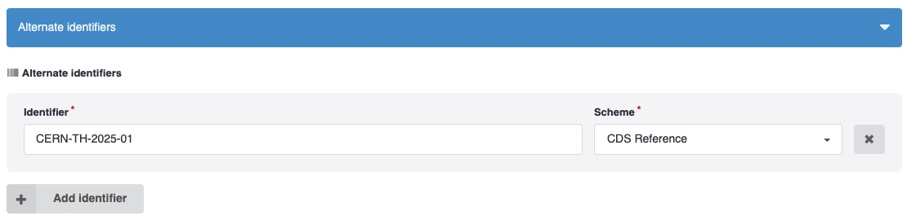
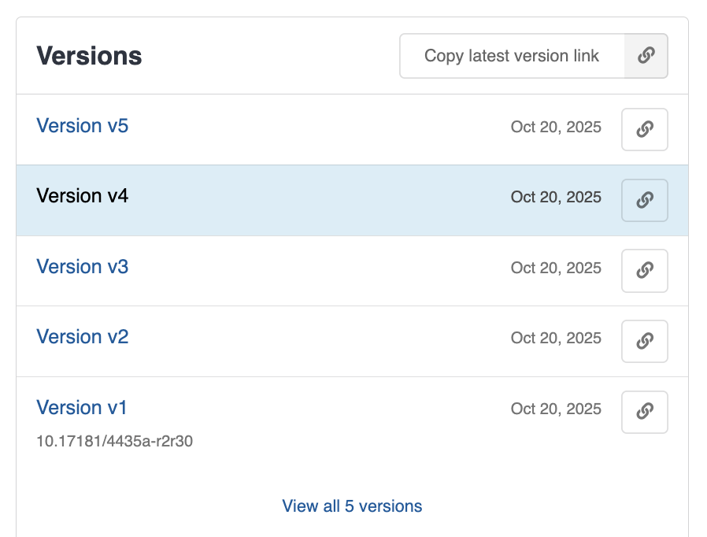
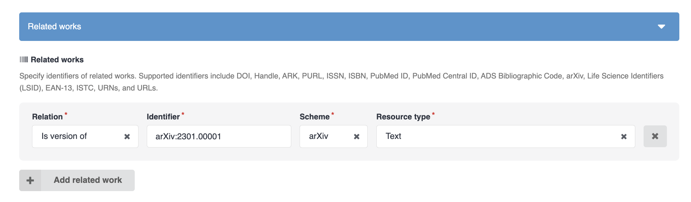
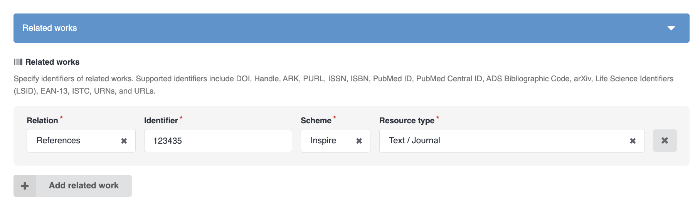

# Frequently Asked Questions

## Report Numbers and DOIs

??? question "What happened to report numbers?"

    A [**report number**](glossary.md#report-number) (also called RN or reference number) is an identifier that was automatically created by the previous version of CDS. Examples include `CERN-TH-2024-001` or `CERN-EP-2024-309`.

    In the legacy system, report numbers were often automatically added to submitted PDFs. However, they had significant limitations:

    - **Non-unique references**: no mechanism ensured uniqueness, leading to duplicate references
    - **Difficult to search**: users couldn't reliably resolve or find records using report numbers
    - **Complex maintenance**: custom generation rules for different collaborations made the system complicated
    - **No reservation system**: users would guess the next number for PDFs before submission, but the number could change, causing errors

    !!! info "Important Change"

        The new CDS repository **does not automatically generate report numbers**.

    Instead, you can:

    - Add your own report number(s) in the **Alternate Identifiers** field during submission.
    - Use any format your collaboration prefers.
    - CDS will ensure uniqueness to prevent duplicates.
    - You can re-use the same report number(s) across versions of the record.

    

??? question "Use DOIs instead"

    The new CDS repository follows international open science best practices by assigning [**DOIs**](glossary.md#doi) (Digital Object Identifiers) to all publications.

    - **Prefix:** `10.17181`
    - **Registration:** All DOIs are registered with [DataCite](https://datacite.org)
    - **Assignment:** Automatic upon publication (or can be reserved in advance)

    !!! tip "Learn More"

        See the [Upload](deposit/upload.md) documentation to learn how to manage DOIs for your uploads.

??? question "What is a DOI?"

    A [DOI](glossary.md#doi) is a persistent, globally unique identifier for digital objects that:

    - Provides a stable, permanent link to your publication
    - Follows the format `https://doi.org/10.xxxx/xxxxx`
    - Enables reliable citation and discovery across platforms
    - Is recognized worldwide as the standard for scholarly work

## Citations & Authors

??? question "Why don't contributors appear in the citation?"

    Only **Creators** are included in the generated citation. **Contributors** are intentionally excluded — they record people who contributed to the work but should not be credited as authors for citation purposes.

    If a person must appear in the citation, add them as a **Creator** instead. You can still assign them a specific role (e.g. Editor) in the creator form.

??? question "Where is the citation data coming from? Why does it have different format depending on resource type?"

    The citation displayed on a record page is generated from the record's [metadata](glossary.md#metadata) fields such as title, creators, publication date, DOI, publisher, and resource type.

    CDS uses the [Citation Style Language (CSL)](https://citationstyles.org) to format citations.

    The format varies by resource type because different types of works have different metadata fields and follow distinct scholarly conventions. For example:

    - A **journal article** includes the journal name, volume, issue, and page range.
    - A **conference paper** includes the proceedings title (or event name).
    - A **thesis** includes the awarding institution.
    - A **technical report** includes the institution and report number.

    !!! tip "Improve your citation"

        To get the most accurate and complete citation, make sure all relevant metadata fields are filled in during submission.

??? question "Why can't I find an author by ORCID™ iD in the deposit form?"

    We update the authors' list periodically, if an author does not appear in the results, their ORCID may not have been imported yet.

    In that case, please contact the [CDS support team](https://cern.service-now.com/service-portal?id=service_element&name=CDS-Service).

## Access & Sharing

??? question "How do I allow my colleague to edit my record?"

    Click the **Share** button on the [deposit form](glossary.md#deposit-form) or record page, go to the **People** (or **Groups**) tab, search for the user or group, and set the permission to **Can edit**.

    See [Access & Share](deposit/access-share.md) for full details.

??? question "How do I allow an external collaborator to submit a record on my behalf?"

    External collaborators do not have a CERN account and cannot submit a record. To let them contribute a record:

    1. Create a new [draft](glossary.md#draft) upload on their behalf.
    2. Click **Share** on the deposit form, go to the **Links** tab, and create a [shareable link](glossary.md#shareable-link) with **Can edit** permission.
    3. Send the link to the external collaborator. They can use it to fill in the metadata and files without a CERN account.
    4. Once they are done, you can review and publish the record.

    !!! danger "Always set an expiration date"

        Set an expiration date on the link to limit how long edit access remains valid.

??? question "How can I allow a researcher from outside CERN to access my restricted record?"

    You can grant access to external collaborators using a [**shareable link**](glossary.md#shareable-link). Click the **Share** button on the deposit form or record page, open the **Links** tab, and click **Create a new link**. Choose the appropriate permission level (**Can view** for read-only access) and copy the generated URL to share with the external researcher. No CERN account is required to use the link.

    !!! danger "Always set an expiration date"

        You **must** set an expiration date when creating shareable links for [restricted](glossary.md#restricted) records. Without an expiration, the link remains valid indefinitely — anyone who obtains it (e.g. through a forwarded email or a shared document) can access the restricted content forever.

        Setting an expiration date ensures that access is time-limited and revoked automatically, reducing the risk of unintended long-term exposure of restricted material.

??? question "How do I see older or newer versions of a record?"

    All versions of a record are listed in the **Versions** panel on the record page. Click any version to navigate to it directly, or use the **Copy latest version link** button to get a permanent link that always resolves to the most recent version.

    { width="400" }

## Communities

??? question "What is a community and why would I create one?"

    A [community](glossary.md#community) is a curated space on CDS where a group of people manage a group of related records. Communities allow you to:

    - **Curate** records by reviewing submissions before they are published.
    - **Manage permissions** by controlling who can submit new records.

    See [About communities](communities/communities.md#create-a-community) for details.

??? question "Where should I submit my record?"

    If you are unsure which community to submit to, see [Where should I submit?](communities/submit.md#where-should-i-submit) for a table of the most common cases.

??? question "How do I allow submissions only from specific people?"

    By default, any CDS user can submit records to a public community. To restrict submissions to specific people or groups:

    1. Add the people or groups as [members](communities/manage.md#members) of the community with at least the **Reader** role.
    2. In the community **Settings**, go to the [Submission policy](communities/manage.md#submission-policy) section and set it to **Closed**.

    With a closed submission policy, only community members can submit records. Non-members will no longer be able to submit.

    See [Manage a community](communities/manage.md#submission-policy) for full details.

??? question "Why doesn't e-groups receive notifications from a community?"

    When a group is added as a member of a community, email notifications are **disabled by default** for that group.

    As a community **Manager** or **Owner**, you can enable notifications for a group:

    1. Open the community and go to the **Members** tab.
    2. Find the group in the member list.
    3. Use the notification toggle next to the group's entry to turn notifications on.

## Uploading

??? question "Which resource type should I use?"

    The resource type describes the nature of your upload and affects how metadata fields are displayed, how citations are formatted, and how the record is indexed. Choose the type that best matches your content:

    | Resource type | When to use |
    |---|---|
    | **Journal article** | A peer-reviewed article published in a journal |
    | **Preprint** | A version of a paper shared before peer review |
    | **Conference paper** | A paper submitted to or published in conference proceedings |
    | **Thesis** | A PhD, Master's, or Bachelor's thesis |
    | **Report** | An internal report, technical note, or working paper |
    | **Dataset** | A collection of raw or processed data |
    | **Software** | Source code, scripts, or software packages |
    | **Presentation** | Slides or other presentation material |
    | **Poster** | A conference poster |
    | **Image** | A photograph, figure, or illustration |
    | **Other** | Anything that does not fit the above categories |

    If your upload could fit more than one type, choose the one that best represents its primary purpose.

## Editing Records

??? question "My upload is 'in review', what can I do?"

    When you submit a record to a [community](glossary.md#community), it enters the **in review** state and waits for a community [curator](glossary.md#curator) to approve or decline it. During this time:

    - You can still **edit** the record [metadata](glossary.md#metadata) and files. Go to **My uploads** on your dashboard, open the record, make your changes, and save.
    - You can **cancel the review request** if you need to withdraw the submission.
    - You can **comment** on the review to communicate with the community curators.

    If the record has been waiting for a long time, consider reaching out to the community managers.

    See [Review process](review/review.md) for more details.

??? question "Can I edit a record after submitting it for review or after it is published?"

    **While under review**, both [metadata](glossary.md#metadata) and files can still be edited. Go to your upload form (accessible from your dashboard under **My uploads**) and save your changes.

    **After publication**, metadata can still be edited, but files on a [published record](glossary.md#published-record) cannot be edited. To add or replace files, you must create a [new version](glossary.md#new-version) of the record.

??? question "I made a mistake in my file. How can I replace it after publication?"

    Files on a [published record](glossary.md#published-record) **cannot be edited or replaced directly**. To correct a file, you need to **create a [new version](glossary.md#new-version)** of the record:

    1. Go to **My uploads** on your dashboard and open the published record.
    2. Click **New version**.
    3. Upload the corrected file(s).
    4. Save and publish the new version.

    !!! info "Versioning"

        Each version of a record is preserved and remains accessible. The latest version is shown by default, and all previous versions can be accessed from the **Versions** panel on the record page.

    See [Published records](deposit/published-records.md) for more details.

## Linking Records

??? question "How do I link a CDS publication with the one in arXiv?"

    Edit your record and scroll to the **Related works** (or use find feature ctrl+F to find the field) section of the [deposit form](glossary.md#deposit-form). Click **Add related work** and fill in the form with:

    | Field | Value |
    |-------|-------|
    | **Scheme** | *arXiv* |
    | **Identifier** | The arXiv ID, e.g. `2301.00001` |

    

    Save the [draft](glossary.md#draft) and publish. The arXiv entry will appear under "Related works" on the record page as a clickable link to arXiv.

??? question "How do I link a CDS publication with the one in INSPIRE-HEP?"

    Edit your record and scroll to the **Related works** section of the [deposit form](glossary.md#deposit-form). Click **Add related work** and fill in the form with:

    | Field | Value |
    |-------|-------|
    | **Scheme** | *Inspire* |
    | **Identifier** | The numeric INSPIRE literature ID, e.g. `1234567` |

    You can find the INSPIRE literature ID in the URL of the record on [inspirehep.net](https://inspirehep.net): `https://inspirehep.net/literature/<id>`.

    

    Save the [draft](glossary.md#draft) and publish. The INSPIRE entry will appear under "Related works" on the record page as a clickable link to INSPIRE-HEP.
