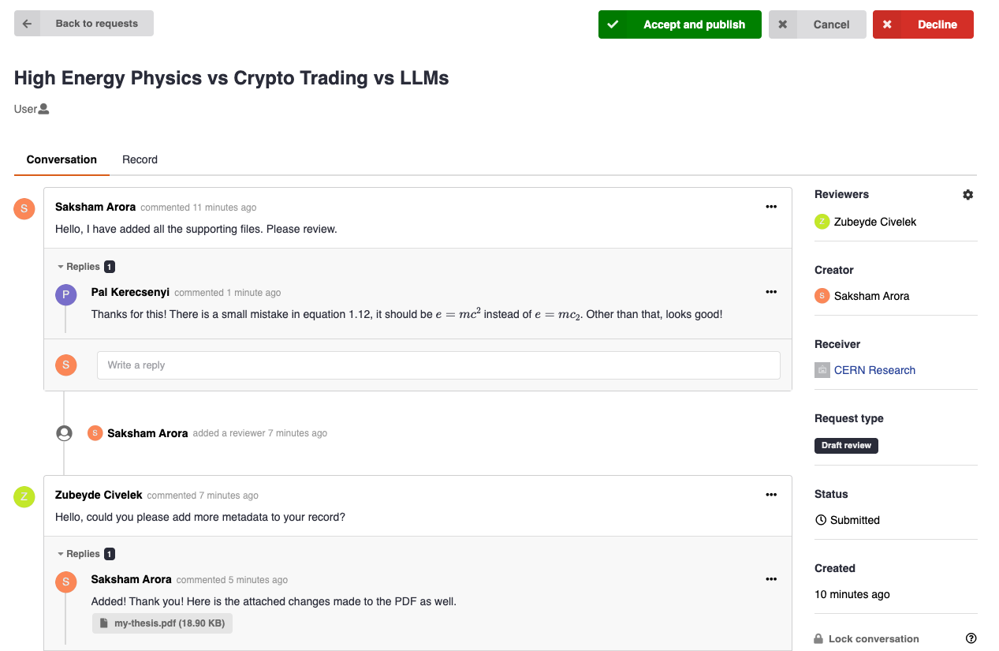
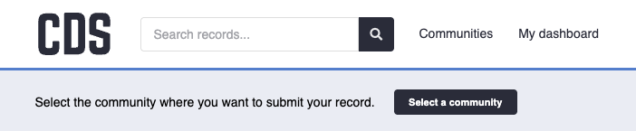
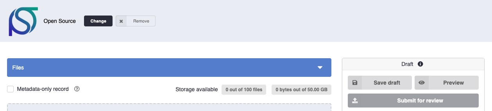

# Review process

A review is the process by which a community evaluates a record before accepting it. When you submit a record to a community, a **submission request** is created. This request acts as a shared workspace between you and the community curators: both sides can exchange comments, request changes, and track the outcome — all without leaving CDS.

## Who takes part

| Role | Who | What they can do |
|---|---|---|
| **Submitter** | The person who uploaded the record and submitted it to the community | Submit, edit the record during review, cancel the request, comment |
| **Curator** | A community member with the Curator role or above | Accept or decline the request, comment, invite reviewers |
| **Reviewer** | Any CDS user explicitly invited to the request by a curator | View the request and comment; cannot accept or decline |

Curators can invite any CDS user as a reviewer on a specific submission, even if that person is not a community member. This is useful when specialist input is needed before a decision is made. See [Commenting](comments.md) for details on how to use the conversation features during a review.

## Typical workflow

### 1. Submission

To submit a record, you must choose a community, the submission process always requires selecting a community.

- **During upload**: Before publishing, select the community in the deposit form. The record will not be published until a curator accepts the submission.
- **After publishing**: See [Submit to a community](../communities/submit.md#multiple-communities) for details on how to submit to another community.

### 2. Review

Once submitted, the request appears in the community's **Requests** tab, visible to all curators, and the record will show as **In review** on [your dashboard](https://repository.cern/me/uploads). The curators can:

- Read the record and its metadata.
- Leave comments or ask for changes (see [Commenting](comments.md)).
- Invite additional reviewers.

You will receive an email notification if a curator leaves a comment. You can update the record's metadata and ask for a re-review by dropping a comment.

### 3. Decision

The curator will make one of two decisions:

**Accepted**

- If the record was not yet published, it is **published automatically** and added to the community.
- If the record was already published, it is **added to the community**.

**Declined**

- The record is not added to the community. If it was not yet published, it remains as a draft and you can continue editing or publish it to a different community.
- You cannot resubmit the same record to the same community after a decline. If you believe the decision was made in error, contact the community curators directly.

### 4. After the review

Once a request is closed (accepted or declined), the conversation is preserved and remains readable. If the conversation is locked, no further comments can be added. See [Locking the conversation](comments.md#locking-the-conversation) for details.

If you want to remove an accepted record from a community at a later point, see [Removing from a community](../communities/submit.md#removing-from-a-community).

## Cancelling a pending submission

If you change your mind before a curator has made a decision, you can cancel the submission request. Open the request from the record's page and click **Cancel request**. The record is not affected; if it was not yet published, it remains as a draft.
