# How to search

This page explains how to use advanced search queries in CDS and how to narrow results with the filters in the search interface.

The options below can help you make your search more precise.

## Filters

After you run a search, you can use the filters in the left-hand panel to narrow the results without rewriting your query.

### Available filters

CDS search currently includes these filters in the user interface:

- **Publication date**: narrow results to a specific year or date range
- **Access status**: limit results to records such as **Open**, **[Restricted](../glossary.md#restricted)**, or **Metadata-only**
- **File type**: filter by file format
- **[Resource type](../glossary.md#resource-type)**: filter by the kind of record, for example publication, dataset, image, or other resource categories

<figure markdown>
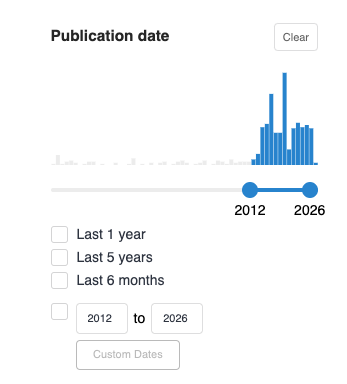
  <figcaption>Publication date filter.</figcaption>
</figure>

<figure markdown>
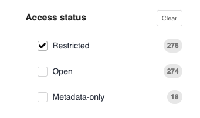
  <figcaption>Access status filter.</figcaption>
</figure>

<figure markdown>
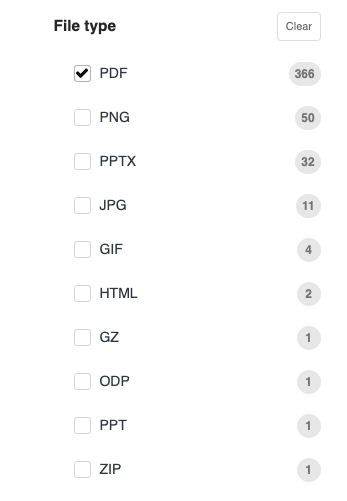
  <figcaption>File type filter.</figcaption>
</figure>

<figure markdown>
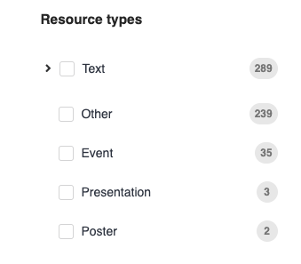
  <figcaption>Resource type filter.</figcaption>
</figure>

### How to use filters

1. Run a search.
2. Look at the filters in the left-hand panel of the results page.
3. Apply one filter at a time to narrow the results.
4. Add more filters if you want to narrow the list further.
5. Remove a filter, or clear all filters, if the result list becomes too narrow.

Filters work together with your search query. For example, you can start with a query in the search bar and then use filters to narrow the results by publication date or resource type.

### Example of filtered results

In this example, the search results are narrowed by publication date, access status, and file type. Applying filters reduces the number of results and helps you focus on the records that match your needs more closely.

<figure markdown>
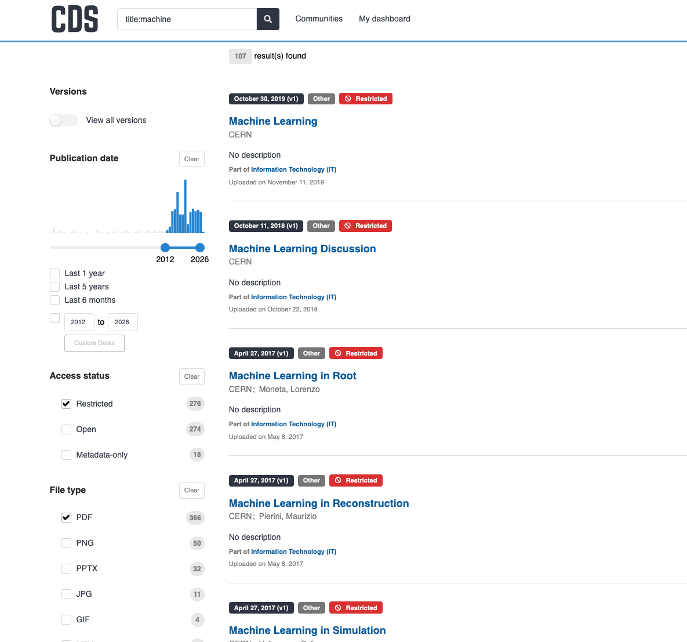{ width="900" }
  <figcaption>Results narrowed by publication date, access status, and file type.</figcaption>
</figure>

### When to use filters instead of a more complex query

Filters are often the easiest choice when:

- you already have a useful result list but want fewer results
- you want only a certain resource type
- you want records from a certain period
- you want to limit results by access status

!!! warning
    If you expect a record to appear but cannot find it, clear the active filters and try again. A filter may be excluding results that otherwise match your search.

## Advanced queries

Advanced queries help you search more precisely by using certain special characters or phrases, field names, and ranges.

### Search for one or more words

You can search for one word or several words.

Example:

- `open science`

This type of search looks for the words you enter.

If you want to require both words, use either `+` or `AND`.

Examples:

- `+open +science`
- `open AND science`

<figure markdown>
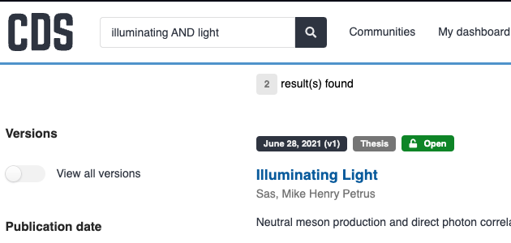
  <figcaption>Example result for `illuminating AND light`.</figcaption>
</figure>

If you want to exclude a word, use either `-` or `NOT`.

Examples:

- `-open +science`
- `NOT open AND science`

<figure markdown>
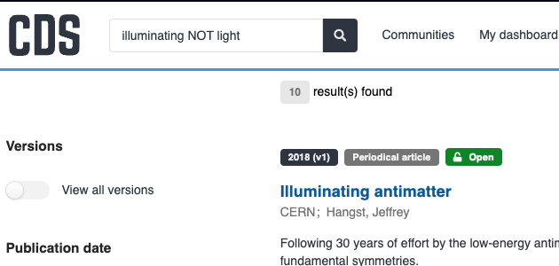
  <figcaption>Example result for `illuminating NOT light`.</figcaption>
</figure>

### Search for an exact phrase

Use quotation marks when you know the exact wording of a title, name, or expression and want CDS to search for that exact phrase.

<figure markdown>
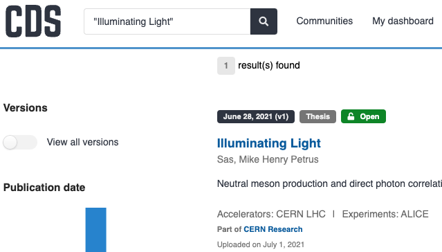
  <figcaption>Example result for `"Illuminating Light"`.</figcaption>
</figure>

### Search in a specific field

You can search in a specific field by writing the field name, followed by a colon, followed by your search term.

<figure markdown>
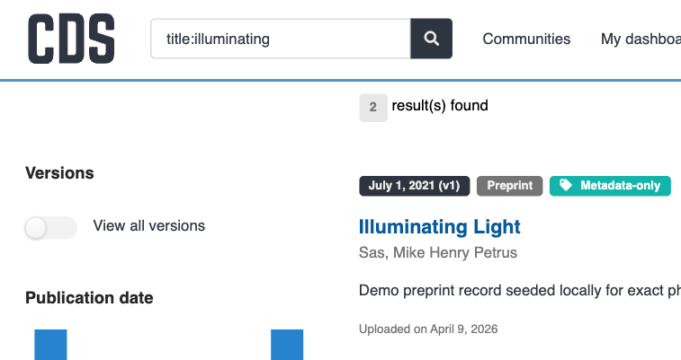{ width="700" }
  <figcaption>Example result for `title:illuminating`.</figcaption>
</figure>

Examples:

| Search | What it does |
| --- | --- |
| `title:open` | searches for `open` in the title |
| `title:"open science"` | searches for the exact phrase in the title |
| `creator:"ATLAS Collaboration"` | searches for a creator name |
| `publisher:CERN` | searches for the publisher |
| `description:policy` | searches in the description |
| `language:en` | searches for records in English |
| `publication_date:2024-01-01` | searches for a specific publication date |
| `doi:"10.17181/example-doi"` | searches for a [DOI](../glossary.md#doi) |
| `cds:12345` | searches for a CDS identifier |
| `cdsrn:CERN-THESIS-2021-078` | searches for a CDS [report number](../glossary.md#report-number) |
| `experiment:ATLAS` | searches for an experiment |
| `department:EP` | searches for a department |

When you search for a DOI, put the DOI value in double quotes.

### Combine different query types

You can combine simple terms, exact phrases, and field searches in the same query.

Examples:

- `title:"open science" AND creator:CERN`
- `title:(open science)`
- `+title:"open science" -description:policy`

Use parentheses when you want to keep terms together inside the same field.

<figure markdown>
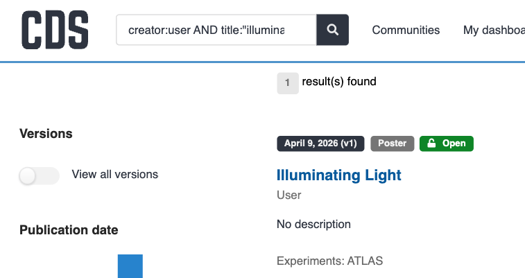
  <figcaption>Example result for `creator:user AND title:"illuminating light"`.</figcaption>
</figure>

### Search by date range

Use a range query when you want records from a specific period or date interval.

Examples:

- `publication_date:[2017 TO 2018]`
- `publication_date:[2017-01-01 TO 2017-12-31}`
- `publication_date:{* TO 2017-01-01}`
- `publication_date:[2017-01-01 TO *]`

<figure markdown>
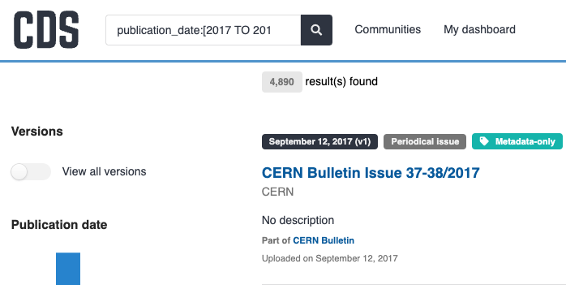
  <figcaption>Example result for `publication_date:[2017 TO 2018]`.</figcaption>
</figure>

Rules to remember:

- `TO` must be written in capital letters.
- Square brackets `[]` mean the start or end value is included in the range.
- Curly brackets `{}` mean the start or end value is not included in the range.
- Mixed brackets such as `[}` let you include the start value and exclude the end value.
- You can use `*` for an open-ended range.

### Search for missing values

You can search for records that have, or do not have, a value in a field.

Examples:

- `_exists_:metadata.creators`
- `NOT _exists_:metadata.additional_titles`

### Other supported advanced syntax

CDS also supports several more advanced query types:

<ul>
  <li>
    <strong>Regular expressions</strong>: <code>pids.doi.identifier:/10\.5281.*/</code>
    Use this when you want to match a pattern instead of one exact value. For example, this can help if you want to find records whose DOI starts with the same prefix.
    <ul>
      <li>Example: to search for records with a CERN DOI prefix, use <code>pids.doi.identifier:/10\.17181\/.*/</code></li>
    </ul>
  </li>
  <li>
    <strong>Fuzzy search</strong>: <code>oepn~</code>
    Use this when you want CDS to look for a word that is close to your search term. This can help if you are not sure about the spelling or if a word may contain a typo.
    <ul>
      <li>Example: <code>quantm~</code> can help find results for <code>quantum</code>.</li>
    </ul>
  </li>
  <li>
    <strong>Proximity search</strong>: <code>"open science"~5</code>
    Use this when you want CDS to find words that appear close to each other, but not necessarily as one exact phrase. This can help when you remember the important words but not their exact order.
    <ul>
      <li>Example: <code>"large collider"~3</code> can help find results where the words appear near each other.</li>
    </ul>
  </li>
  <li>
    <strong>Wildcards</strong>: <code>ope? scien*</code>
    Use this when you want to match small variations of a word. For example, wildcards can help if you want to search for singular and plural forms, or several words with the same beginning.
    <ul>
      <li>Example: <code>physic*</code> can match words like <code>physics</code> or <code>physicist</code>.</li>
    </ul>
  </li>
  <li>
    <strong>Boosting</strong>: <code>title:"open science"^5 description:"open science"</code>
    Use this when you want one part of the query to matter more than another. For example, you might want matches in the title to rank higher than matches in the description.
    <ul>
      <li>Example: <code>title:"machine learning"^5 description:"machine learning"</code> gives more weight to title matches.</li>
    </ul>
  </li>
</ul>

!!! tip
    Wildcard and regular expression searches can be powerful, but they can also be slower and harder to read. Use them only when a simpler query is not enough.
